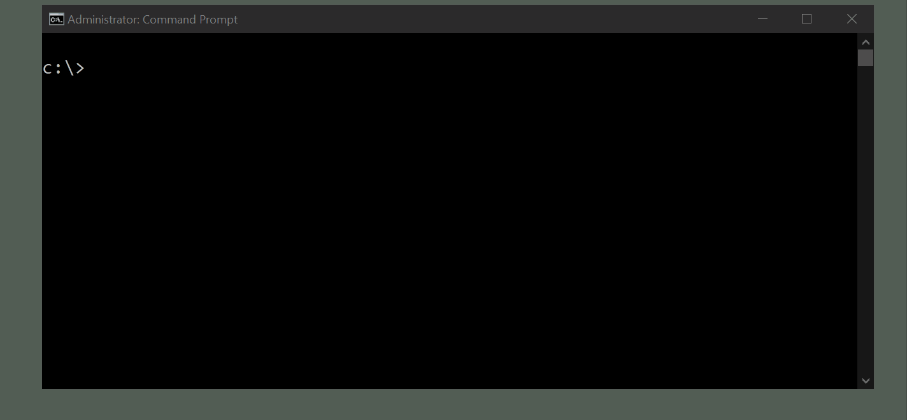

# mincrypt

A basic POC for sending secure messages between parties, written in C#.

## How it works

1. Alice and Bob each generate 2048-bit RSA keys.
2. They next each generate a `ECDiffieHellmanPublicKey`.
3. Prior to sending their ECDH public keys to each other they sign them with their RSA private keys, using SHA-256.
4. Given the other person's ECDHPK and signature, they use their RSA public key to check the signature and verify it hasn't been altered in transit.
5. With keys exchanged Alice and Bob are able to securely generate a shared AES key and send a message.

